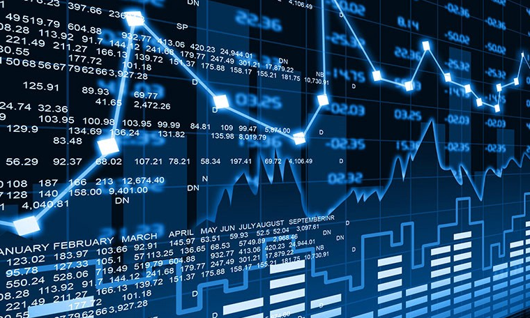

# Stock Technical Analysis

## Machine Learning Stock-Purchase Bot 
Using historical stock data from the Y-finance API, this analyzer reviews three signals to generate a purchase recommendation.  
The analysis particularly reviewed  stocks impacted positively or negatively by COVID-19 to train the data against a volitile time in the stock market. 
## Three main points of analysis
### MACD (Moving Average Convergence Divergence)
- Analysis of the difference between the 12-day & 26-day Exponential Moving Average, overlayed on the 9-day Exponential moving Average. Signals are the points at which these lines cross

# ABBV Plots:

# BAC Plots:

# CVX Plots: 

### RSI (Relative Strength Index)
- Evaluation of recent pricing fluctuations to determine whether a security is being overbought or oversold. 

# RSI ABBV Plots:

# RSI BAC PLots:

# RSI CVX Plots

### Momentum
- Acceleration of a security’s price or volume. Relies on short-term movements over fundamental value

